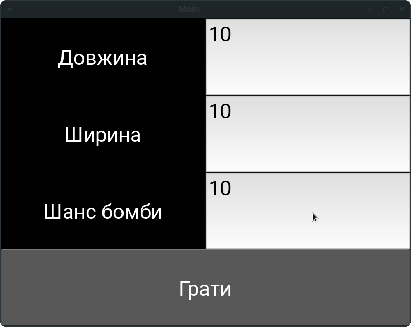
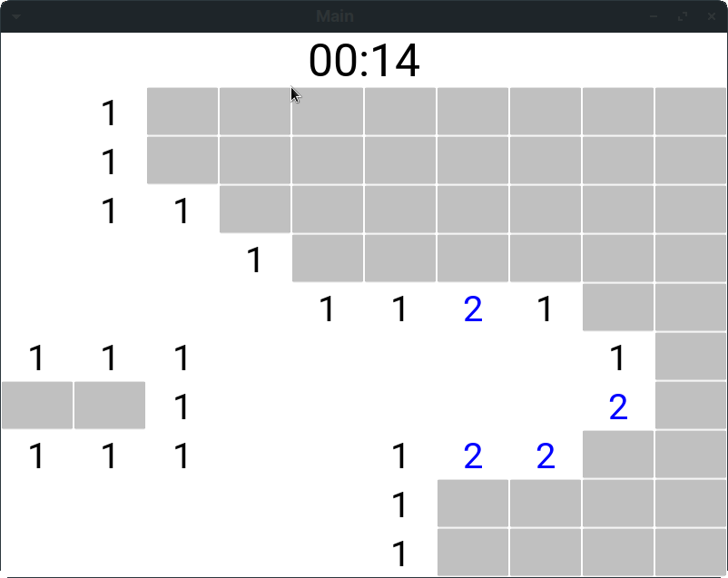
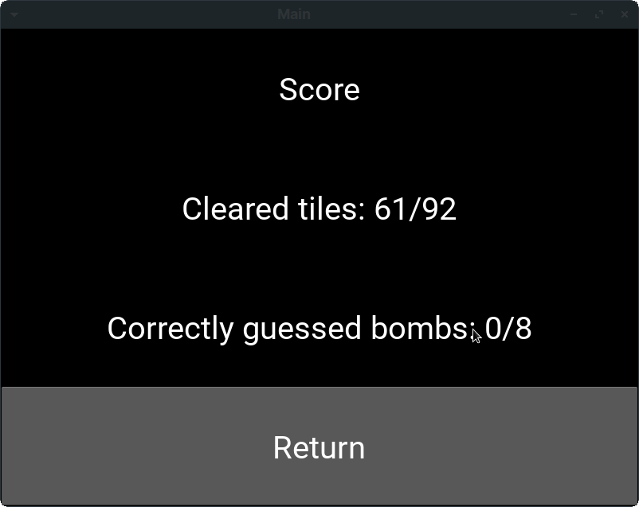

# Сапер

Творче завдання з Технологій Програмування. Варіант 10.
Автор Колібабчук Д. І. Б2

## Запуск

Щоб запустити гру запустіть файл `src/main.py` або введіть команду `make run` якщо у вас є GNU Make

## Скріншоти

